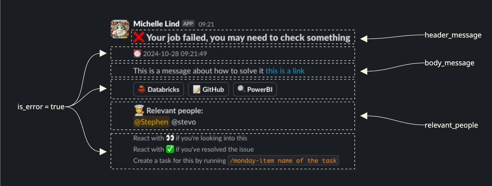

# Slack Connector 💬

A Python package to send notifications to Slack from Databricks workflows or Python scripts.

## Installation

```bash
chef add slack-connector
```

## Quick start

```python
from slack_connector.slack_notification import send_slack_notification

important_number = 2*10
url_to_check = "https://databricks.com"

send_slack_notification(
    environment="dev",
    header_message="❌ Your job failed, please check Databricks",
    body_message=(
        f"🙋‍♂️ Something has happened in your workflow, "
        f"it could be bad, or good, we'll find out soon. "
        f"The important number is {important_number} "
        f"and the URL to check is <{url_to_check}|here>."
    ),
    relevant_people="stephen, engineering",
    is_error=True,
)
```

_And here is an example of what the notification looks like:_



## Functionality
The main functionality of this package is to send notifications to Slack from Databricks workflows or Python scripts.

The main use stems from the `slack_connector.slack_notification.send_slack_notification()` function. By calling this function, a notification will be sent to a Slack channel. Which channel, and what the notification will look like, is determined by the parameters passed to the function.

These parameters are:
- `environment`: The environment the notification is being sent from. This is used to determine which Slack channel the notification will be sent to.
- `header_message`: The header of the notification.
- `body_message`: The body of the notification.
- `relevant_people`: A comma separated list of people who should be notified about the notification. This can either be a list of short names or a group.
- `is_error`: A boolean value indicating whether the notification is an error notification.

### `environment`

The `environment` parameter is used to determine which Slack channel the notification will be sent to, and also where the URLs will send you to.

It should be one of: `local_dev`, `dev`, `test`, or `prod`.

- `local_dev` notifications are sent to `#data_platform_notifications_local_dev`
- `dev` notifications are sent to `#data_platform_notifications_dev`
- `test` notifications are sent to `#data_platform_notifications_test`
- `prod` notifications are sent to `#data_platform_notifications_prod`

### `header_message`

The `header_message` parameter defines the header of the notification. It is optional.

This is where you provide users with a quick summary of what has happened.

E.g. `❌ Your job failed, please check Databricks`

### `body_message`

The `body_message` parameter defines the body of the notification. It is optional.

This is where you can add more details about what has happened which will be displayed in the notification. For example you might want to output some data, a link to a particular file, or just a more detailed message.

E.g. `🙋‍♂️ This might be due to a change in the data schema. Please check the schema in the Databricks workspace.`

#### Formatting 💅

To insert a link into the text, you can use the following format: `<URL|link_text>`.

E.g. `🔗 Please see the <https://databricks.com|Databricks workspace> for more details.`


### `relevant_people`

The `relevant_people` parameter defines who should be notified about the notification as a comma separated list of short names or groups. It is optional.

The people you list here will be mentioned in the notification. You can either list short names or groups as defined in the `slack_users` dictionary in `slack_connector/constants.py`. You can also pass in a list of slack handles or user_ids if they are not already defined.

E.g. `stephen, engineering`

Available short names:
- `stephen`
- `marie`
- `anna`
- `sylvia`
- `mats`
- `niladri`
- `agathe`
- `lina`
- `daniel`
- `synne`
- `grant`

Available groups:
- `engineering`
- `analytics`
- `science`
- `team`

### `is_error`

The `is_error` parameter defines whether the notification is an error notification. It is optional.

If this is set to `true` then extra information is added to the notification which helps users to troubleshoot the error.

## Usage
There are two common use cases for this package:
1. Sending notifications as a step ina Databricks workflow.
2. Sending notifications from a Python script.

### In Python Script

To send a notification from a Python script, you can simply call the `send_slack_notification()` function with the parameters you need.

```python
from slack_connector.slack_notification import send_slack_notification

important_number = 2*10
url_to_check = "https://databricks.com"

send_slack_notification(
    environment="dev",
    header_message="❌ Your job failed, please check Databricks",
    body_message=f"🙋‍♂️ Something has happened in your workflow, it could be bad, or good, we'll find out soon. The important number is {important_number} and the URL to check is <{url_to_check}|here>.",
    relevant_people="stephen, engineering",
    is_error=True,
)
```

### In Databricks Workflow

To use this package in a workflow, for example to notify about the success or failure of a workflow step, you can either create a Python
script task and call the `send_slack_notification()` function, or you can simply create a task that runs the pre-made job `slack_connector/jobs/slack_notification.yml` with the parameters you need.

A Databricks workflow would look something like this:

```yaml
tasks:
    - task_key: some_task
    - task_key: slack_error
        depends_on:
        - task_key: some_task
        run_if: ALL_FAILED
        run_job_task:
            job_id: `id of the slack_notification job, e.g. 221967110790300`
            job_parameters:
                environment: `dev`
                header_message: ❌ Your job failed, panic!
                body_message: 🙋‍♂️ Something has happened in your workflow. Check Databricks
                for more details
                is_error: "true"
                relevant_people: stephen, engineering
```

#### `job_id`

The `job_id` is the ID of the pre-made job that is used to send notifications.

They are different for each environment.

- `dev` workspace: `221967110790300`
- `test` workspace: `221967110790301`
- `prod` workspace: `221967110790302`

#### Limitations

- When sending via the pre-made job, it's less straight-forward to inject relevant data, this method is an easy way to send a standard notification.
