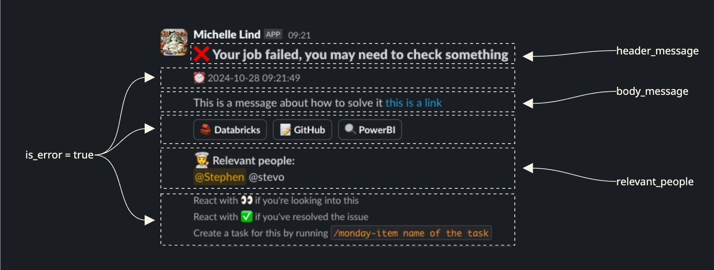

<h1 align="center">
Slack Connector 💬
</h1>

A Python package to send notifications to Slack from Databricks workflows or Python scripts.

## Installation

```bash
chef add slack-connector
```

## Quick start

```python
from slack_connector.databricks_job_url import get_databricks_job_url
from slack_connector.slack_notification import send_slack_notification

job_url = get_databricks_job_url("embedded") #leave empty if part of a workflow

important_number = 2*10
send_slack_notification(
    environment="dev",
    header_message="❌ Your job failed, please check Databricks",
    body_message=(
        f"🙋‍♂️ Something has happened in your workflow, "
        f"it could be bad, or good, we'll find out soon. "
        f"The important number is {important_number} "
    ),
    relevant_people="stephen, engineering",
    is_error=True,
    urls=job_url
)
```


_And here is an example of what the notification looks like:_



## Functionality
The main functionality of this package is to send notifications to Slack from Databricks workflows or Python scripts.

The main use stems from the `slack_connector.slack_notification.send_slack_notification()` function. By calling this function, a notification will be sent to a Slack channel. Which channel, and what the notification will look like, is determined by the parameters passed to the function.

These parameters are:
- `environment`: The environment the notification is being sent from. This is used to determine which Slack channel the notification will be sent to.
- `header_message`: The header of the notification.
- `body_message`: The body of the notification.
- `relevant_people`: A comma separated list of people who should be notified about the notification. This can either be a list of short names or a group.
- `is_error`: A boolean value indicating whether the notification is an error notification.
-  `urls` : The task url of the job

### `environment`

The `environment` parameter is used to determine which Slack channel the notification will be sent to, and also where the URLs will send you to.

It should be one of: `local_dev`, `dev`, `test`, or `prod`.

- `local_dev` notifications are sent to `#data_platform_notifications_local_dev`
- `dev` notifications are sent to `#data_platform_notifications_dev`
- `test` notifications are sent to `#data_platform_notifications_test`
- `prod` notifications are sent to `#data_platform_notifications_prod`

### `header_message`

The `header_message` parameter defines the header of the notification. It is optional.

This is where you provide users with a quick summary of what has happened.

E.g. `❌ Your job failed, please check Databricks`

### `body_message`

The `body_message` parameter defines the body of the notification. It is optional.

This is where you can add more details about what has happened which will be displayed in the notification. For example you might want to output some data, a link to a particular file, or just a more detailed message.

E.g. `🙋‍♂️ This might be due to a change in the data schema. Please check the schema in the Databricks workspace.`

#### Formatting 💅

To insert a link into the text, you can use the following format: `<URL|link_text>`.

E.g. `🔗 Please see the <https://databricks.com|Databricks workspace> for more details.`


### `relevant_people`

The `relevant_people` parameter defines who should be notified about the notification as a comma separated list of short names or groups. It is optional.

The people you list here will be mentioned in the notification, but only in test and prod environments. You can either list short names or groups as defined in the `slack_users` dictionary in `slack_connector/constants.py`. You can also pass in a list of slack handles or user_ids if they are not already defined.

E.g. `stephen, engineering`

Note: People will only be tagged in test and prod environments. In local_dev and dev environments, the relevant_people parameter will be ignored to avoid unnecessary notifications during development.

Available short names:
- `stephen`
- `marie`
- `anna`
- `sylvia`
- `mats`
- `agathe`
- `lina`
- `daniel`
- `synne`
- `grant`

Available groups:
- `engineering`
- `analytics`
- `science`
- `team`

### `is_error`

The `is_error` parameter defines whether the notification is an error notification. It is optional.

If this is set to `true` then extra information is added to the notification which helps users to troubleshoot the error.

### `urls`
Receives the url to display, either directly from `get_databricks_job_url`.
Alternatively, as part of Workflows with multiple upstream tasks, this parameter receives list of upstream notebook urls that failed.

`dbt_tasks` are not yet supported.

## Usage
There are two common use cases for this package:
1. Sending notifications as a step ina Databricks workflow.
2. Sending notifications from a Python script.

### In Python Script

To send a notification from a Python script, you can simply call the `send_slack_notification()` function with the parameters you need.
One can fetch the specific `job_url` directly through this package as well.
This is helpful when sending Slack notifications from __Databricks Jobs__ or python scripts and we want to quickly find the job that failed or fetch further details.


```python
from slack_connector.databricks_job_url import get_databricks_job_url
from slack_connector.slack_notification import send_slack_notification

job_url = get_databricks_job_url("embedded") #leave empty if part of a workflow

important_number = 2*10
send_slack_notification(
    environment="dev",
    header_message="❌ Your job failed, please check Databricks",
    body_message=(
        f"🙋‍♂️ Something has happened in your workflow, "
        f"it could be bad, or good, we'll find out soon. "
        f"The important number is {important_number} "
        f"and the URL to check is <{job_url}|here>."
    ),
    relevant_people="stephen, engineering",
    is_error=True,
)
```

### In Databricks Workflow

To use this package in a workflow, for example to notify about the success or failure of a workflow step, you can either create a Python
script task and call the `send_slack_notification()` function, or you can simply create a task that runs the pre-made job `slack_connector/jobs/slack_notification.yml` with the parameters you need.

In order for this to work, you need to first update your `databricks.yml` file with the correct job IDs for each environment, such that they can be read in when deployed, like so:

```yaml
variables:
  slack_notification_job_id:
    description: The id of the slack notification job to call

targets:
  dev:
    default: true
    variables:
      slack_notification_job_id: 221967110790300
  test:
    variables:
      slack_notification_job_id: 823927532277018
  prod:
    variables:
      slack_notification_job_id: 808732355997444
```

Then, in your workflow, you can add a task that runs the pre-made job `slack_connector/jobs/slack_notification.yml` with the parameters you need, like so:

```yaml
tasks:
    - task_key: some-task
    - task_key: slack-notification
        depends_on:
        - task_key: some-task
        run_if: ALL_FAILED
        run_job_task:
            job_id: ${var.slack_notification_job_id} #Reads from the variable defined in the databricks.yml file
            job_parameters:
                environment: ${bundle.target} #Reads from the target environment as defined in the databricks.yml file
                header_message: ❌ Your job failed, panic!
                body_message: 🙋‍♂️ Something has happened in your workflow. Check Databricks
                for more details
                is_error: true
                relevant_people: stephen, engineering
```

#### Limitations

- When sending via the pre-made job, it's less straight-forward to inject relevant data, this method is an easy way to send a standard notification.

### Workflow notifications for notebook tasks

Initial support for slack notifications for workflows with notebook tasks is also available.
To fetch the URL of a task running a notebook in a workflow, the default `get_databricks_job_url()` will work.

If instead one wants to use it embedded in a standalone python script or Databricks notebook then the parameter `embedded` is needed like `get_databricks_job_url("embedded")`
This is due to the fact that Databricks constructs the Job URLs differently depending on if they are run part of a larger workflow or executed as standalone jobs.

Here is a DAB template that integrates the `slack_connector` package into a workflow providing info on the exact the upstream tasks that failed.

```yaml
resources:
  jobs:
    your-new-job:
      name: "Your New Job"

      job_clusters:
        - job_cluster_key: cluster_name
          new_cluster:
            num_workers: <>
            spark_version: <>
            node_type_id: <>
            docker_image:
              url: "${var.docker_image_url}"
              basic_auth:
                username: "{{secrets/auth_common/docker-registry-username}}"
                password: "{{secrets/auth_common/docker-registry-password}}"


      tasks:
        - task_key: task_one
          job_cluster_key: cluster_name
          notebook_task:
            notebook_path: "./task_one_notebook.py"


        - task_key: task_two
          job_cluster_key: cluster_name
          notebook_task:
            notebook_path: "./task_two_notebook.py"

        - task_key: monitoring_task
          depends_on:
            - task_key: task_one
            - task_key: task_two
          run_if: ALL_DONE #this helps run the task without depending on success/failure of upstream tasks
          #relevant when exception handling ensures all are success

          job_cluster_key: cluster_name
          notebook_task:
            notebook_path: "./monitoring_<job_name>.py"

        - task_key: notify_task
          depends_on:
            - task_key: monitoring_task
          run_if: ALL_DONE
          run_job_task:
            job_id: ${var.slack_notification_job_id} #Reads from the variable defined in the databricks.yml file
            job_parameters:
              header_message: "❌ Your Job Failed"
              body_message: "Job to do XYZ failed"
              environment: ${bundle.target}
              urls: "{{tasks.monitoring_task.values.failed_urls}}"
              relevant_people: stephen
              is_error: true

```

**2 important changes** are mandatory to make the above workflow template work:
- **Exception handling** & **status assignment** in task notebooks
- A monitoring script that contains the **task_key** of **all upstream tasks**.


#### Exception handling

Here is an example of a task notebook highlighting exception handling and status assignment:

```python
# Databricks notebook source

from typing import TYPE_CHECKING

if TYPE_CHECKING:
    from databricks.sdk.dbutils import RemoteDbUtils

    dbutils: RemoteDbUtils = ""  # type: ignore

from databricks_env import auto_setup_env

auto_setup_env()

from slack_connector.databricks_job_url import get_databricks_job_url

# COMMAND ----------
url_to_job = None
task_status = None
try:
    # Task logic - all the code of the notebook relevant for the specific task

except Exception as e:
    import traceback

    # If an error occurs, set the status to 'failed'
    task_status = "failed"
    url_to_job = get_databricks_job_url()

    # Log the exception
    traceback.print_exc()
finally:
    # Set the task value to be shared with downstream tasks
    dbutils.jobs.taskValues.set(key="url", value=url_to_job)
    dbutils.jobs.taskValues.set("status", task_status)
```

#### Setting up monitoring

Finally here is the `monitoring_<job_name>.py` that should be present in the same folder as the other tasks in the `jobs` folder.
Adjust `<job_name>`:

```python
# Databricks notebook source
from typing import TYPE_CHECKING

if TYPE_CHECKING:
    from databricks.sdk.dbutils import RemoteDbUtils

    dbutils: RemoteDbUtils = ""  # type: ignore

from databricks_env import auto_setup_env

auto_setup_env()

# COMMAND ----------
# List of upstream task keys
upstream_tasks = ["task_one", "task_two"]  # Add all your upstream task keys here

failed_task_urls = []

for task_key in upstream_tasks:
    try:
        # Retrieve status and URL from each task
        status = dbutils.jobs.taskValues.get(taskKey=task_key, key="status")
        url = dbutils.jobs.taskValues.get(taskKey=task_key, key="url")

        # Check if the task failed
        if status == "failed":
            failed_task_urls.append(url)
    except Exception as e:
        # Handle cases where the task value is not found
        print(f"Could not retrieve status or URL for task {task_key}: {e}")  # noqa: T201

# Join the failed URLs into a single string
failed_urls_str = ",".join(failed_task_urls)

# Set the failed URLs as a task value to be used by downstream tasks
dbutils.jobs.taskValues.set(key="failed_urls", value=failed_urls_str)
```


## Best practices

When sending notifications, please remember:

- Be concise
- Only provide relevant information
- Only tag people if they are relevant
- Use standard emojis to indicate the status of the notification:
  - ✅: Success
  - ❌: Error
  - 🚀: Started
  - 🧑‍🍳: Information
