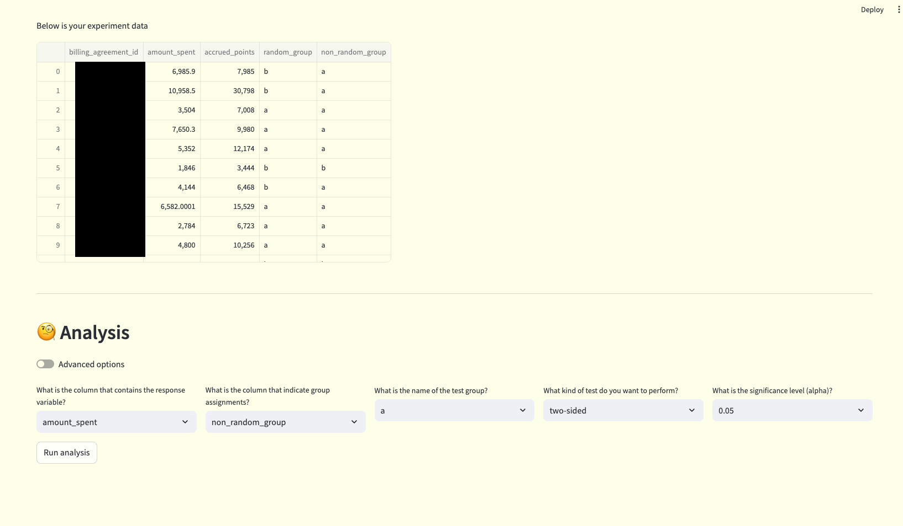

# 🧪 AB Test Analysis
If you are running an A/B experiment and like to conduct statistical testing to see if the experiment has any impact on a metric, this is the place to do it!!

## Launch the app

To run the project from the CLI, use the following command from the root dir.
```bash
# Change directory to the A/B test analysis project
cd ~/path-to-sous-chef/sous-chef/projects/ab-test-analysis

# Install all dependencies
poetry shell
chef install

# activate the virtual environment
# if your virtual environment is called ".venv", do
source .venv/bin/activate
# otherwise replace .venv with the name of your virtual environment

# launch the UI
streamlit run app/run_app.py
```
## Working on the UI
### Fetch experiment data
There are two options to fetch data from this UI
1. (Recommended) Upload an existing sql file using the file uploader widget
2. Write an sql query using the text field

The query must fetches data that contains at least
   - one column that contains the user assignment.
     - typical case: for each agreement_id, if they are assigned to treatment or control group
   - one column that contains the response for your hypothesis.
     - Example: if your hypothesis is that your treatment group will spend more money than control group, then the response_variable could be the ``amount_spent`` per customer throughout the experiment period

There are no restrictions about the column names, they can be named whatever. You can explore the ``ab-test-analysis/sqls/`` folder for some example queries.

Click on the `Run query` button and the data should be fetched

### Run the analysis


You'd need to fill in the information to run the analysis.
Specifically:
1. What is the column that contains the response variable?

     choose the column name from the drop down menu. In the case of the screenshot above, choose "amount_spent"

2. What is the column that indicates group assignment?

     choose the column name that specifies which user goes to which group. In this case, you can choose `random_group` or `non_random_group`

3. What is the name of the test group?

     you should specify the name of the treatment group. This is not as important if we are running a two-sided test, but if you want to run one-tail test then you should be sure to specify the correct name

4. What kind of test do you want to perform?

    - two-sided: if your hypothesis is that treatment group and control group's mean are different. For folks that prefer the statistics language, it means your null hypothesis is H0: mean(treatment) = mean(control)
    - greater: if your hypothesis is that treatment group's mean is larger than control's. In statistical language: H0: mean(treatment) < mean(control)
    - less: the opposite of "greater"

5. What is the significance level

    - default to be alpha = 0.05, you can choose different significance level
    - you can take it as, if we were to run the experiment (1/alpha) = 20 times (collect similar sized sample, and analyze), there is once that we get a fluke (false positive)
    - the higher you choose this value, the higher your tolerance of false positive is

WIP:
For the more advanced users, you can choose the "Advanced options" toggle and get more information.
