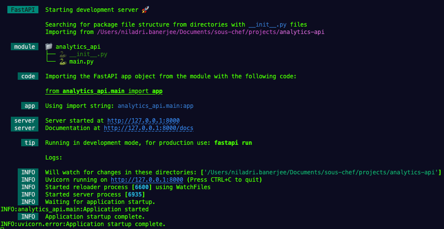
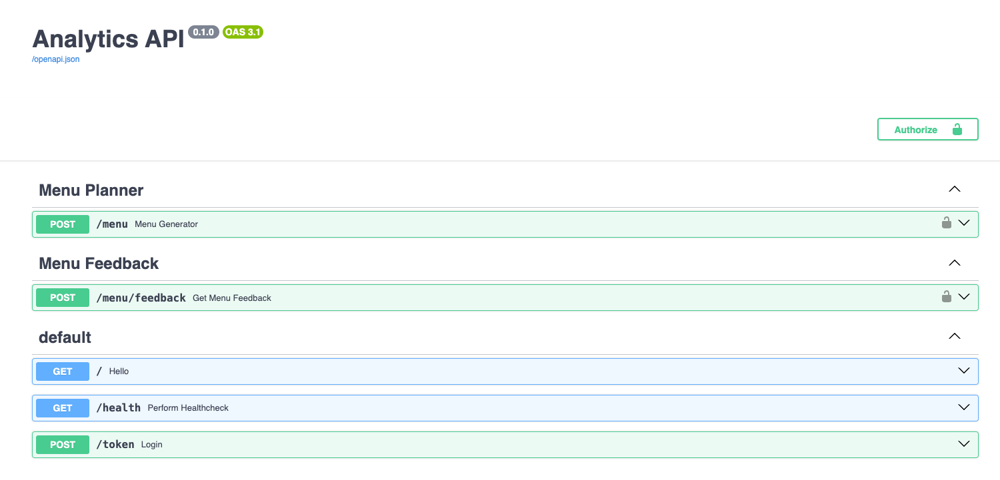
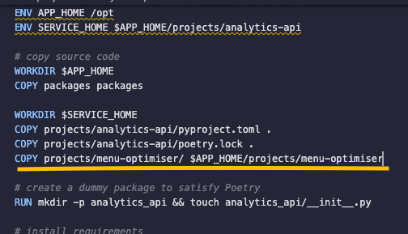
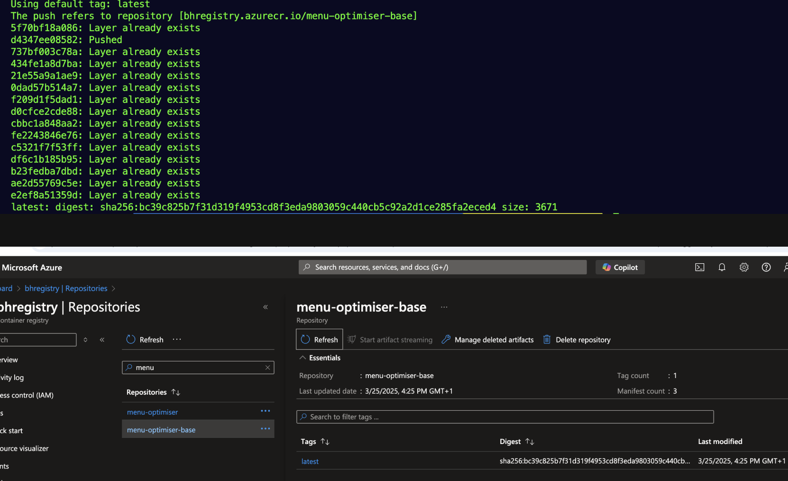
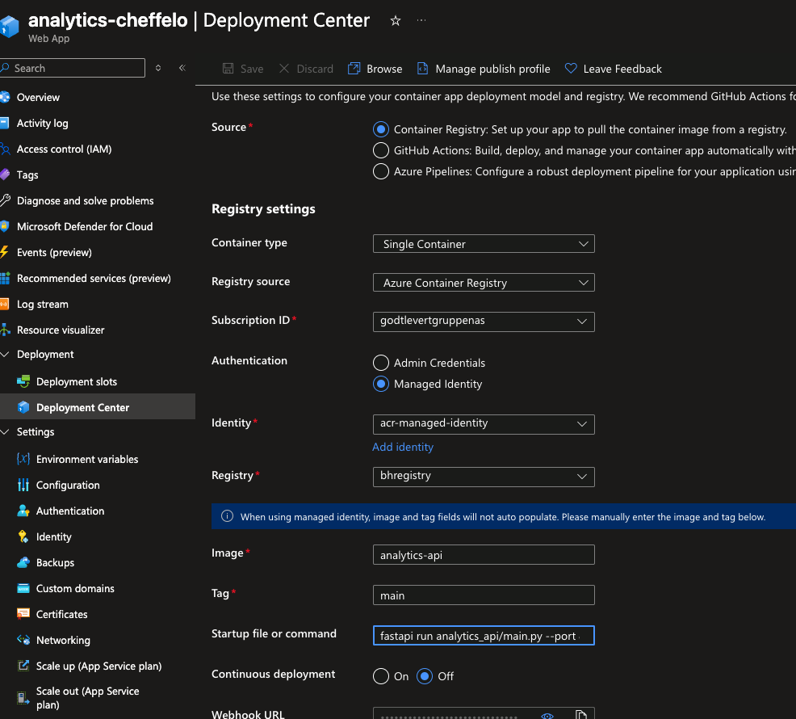
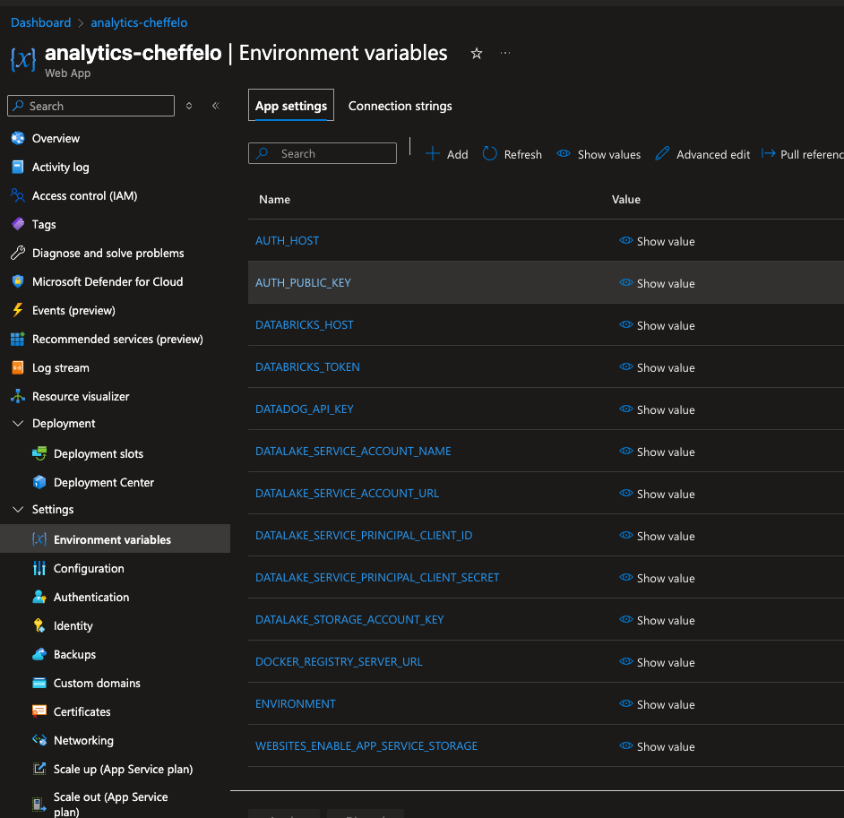

# Analytics API

A collection of endpoints serving various ML and Analytics products

## Development
For local development, ensure that all the requirements from the `pyproject.toml` in the `analytics-api` project are installed in your virtual environment.

It is preferable to pull the latest updates from `main`, create a fresh new branch and run `poetry install`.
In case one has worked within the project before and has an old branch lying around locally, remember to pull the latest updates from `main`into this specific development branch and then perform a fresh `poetry install`

Additionally, make sure that the `.env` file has all the necessary information correctly filled.
Details of what all variables are needed is given in the `.env.example`.

Then to to check all dependencies and packages work correctly run:

`fastapi dev analytics_api/main.py`

Once satisfied, it is preferable to continue working within a Docker environment for further development and this is achieved by running:
`docker compose up api`

This will show a screen similar to the following containing the basic info to get you start testing locally:

Click on the `URL` for _Documentation_, which will lead you the OpenAPI generated docs containing information on the existing endpoints:

To subsequently test the endpoints, e.g. `Menu Generator`, make sure to authorise by clicking on the __lock__ button on top right.
Here one will need the specific user and password that works with the backend `Auth` module.
Ask one of the data team members or the broader tech team in case you are missing the credentials.

### Adding to the project

The current setup of AnalyticsAPI is of a centralised architecture where specific DS/ML products to be served are imported as needed.
This requires that the `Dockerfile` of analytics api is updated accordingly with the path to that specific project.

So given a new ML project that can be found under `/projects/new_cool_stuff` , the analytics api Dockerfile should be updated to include this path.
Here is an example of how the `menu-optimiser` was added:

Additionally, if there are packages specific to the `analytics-api` project itself, they need to be added to the `pyproject.toml` followed by running `poetry lock + poetry install`.
Alternatively, `poetry update`

### Routers

The endpoints to be served are found under the `/routers` folder. This is the place to add the new endpoints.
As the name implies, _router_ is something that gives direction and controls the flow of traffic.
It is therefore the reason endpoints, which direct web traffic are organised under this folder.

One also needs to define the specific __input__ and __output__ models that the endpoint will consume and output.
In other words, we need to define explicitly what all fields are to be expected in a valid input request and what all fields are to be sent back.
Pay extra attention to the case of the fields i.e. is a `snake_case` expected or a `camelCase`?
Such models are defined through `Pydantic` and can be either a part of the _router_ or can be imported as a dependency from the _new cool project_

### Simple troubleshooting tips

Analytics API deployment is handled via Docker image. We do this to ensure what works locally works everywhere else as well.

Following handy commands can help make sure the Docker image is built and works correctly.

- `docker compose build api` - to build the image first time or rebuild it if changes/modifications are made.
- `docker compose up api`- run the API locally through the Docker image.
- `docker compose run -it api bash` - dive inside the Docker image so as to verify all dependencies are installed ( once inside, run `poetry show` and anything in red implies missing package).

### Deployment

The deployment of the Docker images is done via Azure Container Registry. We have an existing registry called `bhregistry` under the `godtlevertguppenas` subscription.
Usually, it is sufficient and recommended to create a PR and let our CI/CD pipeline take care of deploying to the correct registry.

In case there is an issue, there is a manual workaround described below:

Make sure you have `Azure CLI` available in your machine. Installation instructions for macOS and Windows machines can be found [here](https://learn.microsoft.com/en-us/cli/azure/install-azure-cli-macos) and [here](https://learn.microsoft.com/en-us/cli/azure/install-azure-cli-windows?pivots=winget)
 respectively.

 Following successful installation of `Azure CLI`, the following steps are sufficient to update the Docker image in the Azure Container Registry:
 - `az login`- this will log you in and allow to choose specific Subscription. Choose `3` for `godtlevertgruppenas`
 - `az acr login --name bhregistry` - login into the specific container registry
 - `docker tag docker-image-name bhregistry.azurecr.io/docker-image-name` - tag the image you want to push to the registry with the full URL
 - `docker images` - run this to make sure the URL is tagged correctly to the correct Docker image
 - `docker push bhregistry.azurecr.io/docker-image-name` - Push to the registry & verify by comparing the git SHA visible in the terminal & in the registry like:
 

 - Restart the Azure Web App

### Azure Web App
The final step of serving our endpoints is availing an Azure Web App service available at [this link](https://portal.azure.com/#@godtlevertno.onmicrosoft.com/resource/subscriptions/7c54c7c3-c54c-44bd-969c-440ecef1d917/resourcegroups/gg-analytics-backend-prod/providers/Microsoft.Web/sites/analytics-cheffelo/appServices)
It is through this web app that the endpoints are made available to other services like CMS, PIM etc.

There are 2 sections within the web app that are especially important to ensure smooth functioning and availability of our services.
These are `Deployment Center` , found under `Deployment` and `Environment variables` found under `Settings`

Every time there is a new environment variable dependency added to the `.env` file, the same needs to be updated under `Environment variables` section as well.
A concrete example was when `DATABRICKS_HOST` and `DATABRICKS_TOKEN` needed to be added because the same was needed to make the `menu feedback` router work correctly.
