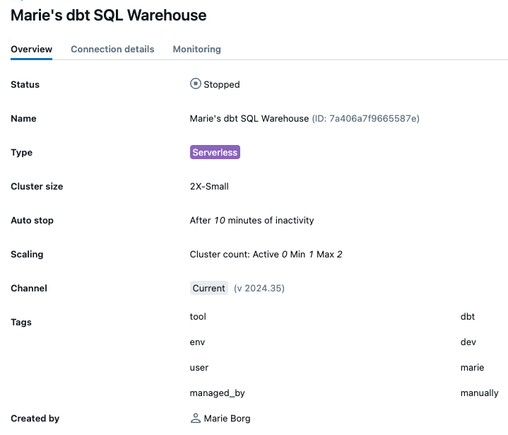

# About the project

This projects holds code for the ETL pipelines of the Data Platform. We use Databricks Notebooks for ingestion, dbt for transformations and Databricks Asset Bundles (DAB) for orchestration (workflows).

## Folder Structure

**data-model/ingest**: Code related to ingestion of source data

**data-model/resources**: Code for setting up workflows using DABs

**data-model/transform**: dbt project files

# Development setup
This section describes how you set up the local development environment.

## DABs
...

## dbt
To get started developing in dbt follow the steps described in this section. This assumes that you have git and [sous-chef](https://github.com/cheffelo/sous-chef) set up in your local development environment (using Visual Studio Code or another IDE).

### 1. [First time only] Set up sql warehouse
When developing in dbt you need to specify which compute to use when deploying your code to the development environment in Databricks. Hence, you need to create a SQL warehouse to be used.

To create a SQL Warehouse you need to go to [Compute > SQL warehouse > Create SQL warehouse](https://adb-4291784437205825.5.azuredatabricks.net/compute/sql-warehouses?o=4291784437205825&page=1&page_size=20).

Settings for the SQL warehouses should be the following:
* `Name`: <Name>'s dbt SQL Warehouse
* `Cluster size`: 2X-Small
* `Auto stop`: After 10 minutes
* `Scaling`: Min: 1 Max: 2
* `Type`: Serverless

Open advanced options to add these four tags which will be used to be able to track costs:
1. `Key`: tool, `Value`: dbt
2. `Key`: env, `Value`: dev
3. `Key`: user, `Value`: first name
4. `Key`: managed_by, `Value`: manually

In advanced options, also have the following settings:
* `Unity Catalog` : on
* `Channel`: Current

See example of set up here:
<p align="center">

</p>

### 2. [First time only] Set up local dbt profile
To connect dbt to Databricks you need to save credentials in a yml-file for the following path on your computer: `[USERPATH]/.dbt/profiles.yml`.

You should copy the template below and fill in the following:

* `schema`: The schema should be your firstname and lastname in the following format firstname_lastname.
* `host`: Copy serverhost name under connection details of your SQL Warehouse.
* `http_path`: Copy HTTP path under connection details of your SQL Warehouse.
* `token`: Follow [these instructions](https://docs.databricks.com/en/dev-tools/auth/pat.html#databricks-personal-access-tokens-for-workspace-users) to generate a personal access token.

**NB!** You never should store the token another place than in the .dbt/profiles.yml.

```yml
 transform:
  target: local_dev
  outputs:
    local_dev:
      type: databricks
      catalog: dev
      schema: firstname_lastname # Need to be configured by you
      host: xyz.azuredatabricks.net # Need to be configured by you
      http_path: /SQL/YOUR/HTTP/PATH # Need to be configured configured by you
      token: dapiXXXXXXXXXXXXXXXXXXXXXXX # Need to be configured configured by you
      threads: 4
```

### 3. Activate virtual environment
When working in dbt you use a virtual environment this will ensure that you are using the right python version and package versions when developing. All the commands written in the instruction below should be run from your terminal.

#### Windows
* Install docker: https://docs.docker.com/desktop/install/windows-install/
* Enter the project folder in sous chef: `cd projects/data-model`
* Spin up: `docker-compose run -it dev bash`

#### Mac
* Enter the project folder in sous chef: `cd projects/data-model`
* Activate the virtual environment: `poetry shell`
* Install dependencies: `poetry install`

If you see the error:
```
The Poetry configuration is invalid:
  - Additional properties are not allowed ('package-mode' was unexpected)
```
Then you may need to update your local Poetry version, do this by running `poetry self update`

### 4. Enter the dbt project
Enter the dbt project by writng this in your terminal: `cd transform`

### 5. [First time only] Check dbt connection
Run `dbt debug` in the terminal, the output should look something like this if the set up are done correctly:

```shell
07:21:56  Running with dbt=1.8.3
07:21:56  dbt version: 1.8.3
07:21:56  python version: 3.11.7
07:21:56  python path: /Users/marie.borg/Library/Caches/pypoetry/virtualenvs/data-model-tSUiXESf-py3.11/bin/python
07:21:56  os info: macOS-14.5-arm64-arm-64bit
07:22:02  Using profiles dir at /Users/marie.borg/.dbt
07:22:02  Using profiles.yml file at /Users/marie.borg/.dbt/profiles.yml
07:22:02  Using dbt_project.yml file at /Users/marie.borg/Documents/Cheffelo/sous-chef/projects/data-model/transform/dbt_project.yml
07:22:02  adapter type: databricks
07:22:02  adapter version: 1.8.3
07:22:02  Configuration:
07:22:02    profiles.yml file [OK found and valid]
07:22:02    dbt_project.yml file [OK found and valid]
07:22:02  Required dependencies:
07:22:02   - git [OK found]

07:22:02  Connection:
07:22:02    host: adb-4291784437205825.5.azuredatabricks.net
07:22:02    http_path: /sql/1.0/warehouses/7a406a7f9665587e
07:22:02    catalog: dev
07:22:02    schema: marie_borg
07:22:02  Registered adapter: databricks=1.8.3
07:22:11    Connection test: [OK connection ok]

07:22:11  All checks passed!
```

> [!TIP]
> If you have errors during the debug, then restarting your machine may do the trick or creating a new access token

### 6. Start developing 🥳
Hurray! Now you can start developing in dbt. 

Please ensure to follow the Git Guidelines (coming) and the guidelines in the [Data Model Deveopment](#data-model-development) section.

## 5. Create pull request
When you are finished developing on the branch you can merge you changes into main. This is done through creating a pull request. You can do that from the [GitHub UI](https://github.com/cheffelo/sous-chef).

# Workflow Development

Coming...

# Data Model Development: Ingest
Changes to ingestion can be done from the Databricks UI. Each source system has a notebook for ingest under the ingest folder. 
1. Go into sous chef from Databricks
2. Pull changes and create a new branch
3. Open the relevant ingest notebook (`bronze_[source]_full`)
4. Add the tables you want to include in the tables list 
5. Commit and push changes from Databricks and create a PR and assign Marie or Anna to review

To ingest the data immediatly to bronze you can run the notebook only for the tables that you have added by either commenting out the other tables or copy the cell and remove the tables that already exist. You can also run the whole notebook, it will not take that much time yet.

# Data Model Development: Transform
This section contains information on how to develop in our dbt project. *Models* refers to the script which does the transformation to the data, while *tables* refers to the end results which is found in Databricks as a table.


## Project layers, Subdirectories and Model Names

### Silver 🥈
Contains raw tables which have been cleansed and standarized.

📁 Subdirectories: Models are divided into folders using the source name as folder name (e.g. cms, pim, product_layer, ops, segment++)
📄 Model names: [sourcesystem]__[source_table_name](s).sql
* All tables that ends with the entity of the table should be end in plural, e.g billing_agreement_order_line contains several order lines, hence the appropriate name is billing_agreement_order_lines
* If the table is a bridge table it should be plural for both entites that are being linked, otherwise only the last word in the table should be plural.
* There are some edge cases where the table name should not be plural, this is for instance if the table name is something else than the entity of the table. E.g. tables that end with ledgend shoyld not be plural as it does not contains several legend but is a legend for some type of item.

### Intermediate 🏄🏻
Performs need transformations to silver tables need before entering the gold layer.

📁 Subdirectories: Models are divided using business groupings as folder names (e.g. common, sales, menu, marketing, operations ++)
📄 Model names: `int_[source_model]_[verb]s.sql`
* The file name should describe the table being transformed and the transformation being done
* Example: `int_billing_agreement_addon_subscriptions_pivoted` or `int_billing_agreements_extract_first_order`.

### Gold 🥇
Join together models from silver and intermediate to create a data model which follow the principles of dimensional data modelling.

📁 Subdirectories: Models are divided using business groupings as folder names (e.g. common, sales, menu, marketing, operations ++)
📄 Model names: `int_[source_model]_[verb]s.sql`, e.g, `int_billing_agreement_addon_subscriptions_pivoted` or `int_billing_agreements_extract_first_order`.
* The model file should start with fact or dim based on the type of table followed by a logic business related name in plain english
* One should NOT create models with the same concept for several teams. I.e., there should not be a table for `finance_orders` and `marketing_orders`.

## Best Practice

### Naming conventions

- 🐍 Use snake_case
- 🚫 Avoid using reserved words (such as [these](https://learn.microsoft.com/en-us/azure/databricks/sql/language-manual/sql-ref-reserved-words) for Azure Databricks)
- 📅 Date should be named as `<event>_date`, e.g. `created_date`
- ⏱️ Timestamp should be names as `<event>_at`, e.g. `created_at`
- 🔙 Events dates and times should be past tense — created, updated, or deleted.
- 🎚️ Booleans should be prefixed with `is_` or `has_` etc., e.g., `is_active_customer` and `has_admin_access`
- 🔑 Id columns that are used as primary keys in the source system should always be called `[table_name]_id` e.g `billing_agreement_id`
- 💪 Consistency is key! Use the same field names across models where possible. For example, an id to the `billing_agreement` table should be named `billing_agreement_id` everwhere rather than alternating with `customer_id`

### General rules SQL
- Use lower case for all code
- Use trailing commas
- Do not use abbreviation in aliase and CTEs, i.e, use `order_lines` rather than `baol`
- Joins should always be done using left join and a where clause if filtering is needed instead of an inner join

#### Code structure
Each model should start with a CTE which does select * from the source/model of interest. In silver you would typically call this CTE `source` since you only extract form one table, while in intermediate and gold whereby you join several models you typically give the CTEs names which referes to the model it reads from. After this there should be one CTE for each bigger transformation step which describes the actitivy of the CTE. Lastly one end the script by doing a `select * from` the last created CTE. See the pseudo code below or look into already created models to checkout the structure.

```
with 

source/model_name as (

    select * from [source/model]

),

main_activity_1 as (

    you're query

)

main_activity_2 as (

    you're query

)

select * from main_activity_2
```

#### Why dbt recommend using CTEs
The reason for using CTEs is to make the code more modular which in turn makes it easier to debug and reuse elements across the project.

For more information about why dbt suggest to use CTEs, read [this glossary entry](https://docs.getdbt.com/terms/cte).

## Deployment of models
After finishing a model in your local development enviroment yoou should deploy it to the Databricks Dev Workspace and check that the result is as expected. If the changes are as expected you can create a pull request.

### Deploy changes from local environment
To assess that changes made has the expected output you need to deploy your changes to Databricks. To do this you can wrtie the following in your terminal.
1. Install dbt packages: `dbt deps`
2. Deploy changes to Databricks Dev Workspace: `dbt build -s +model_filename` 

The deployed changes will end up under your own silver and gold schemas in Databricks which is indentified by having your firstname and lastname as prefix.

> [!TIP]
> Run `dbt` in the terminal to see all the other available commands. Or read more about the commands [in dbts docs](https://docs.getdbt.com/reference/dbt-commands).

### Create pull request
If the changes are as expected and you are happy with your work please create a pull request for Anna and/or Marie to review.

## Modelling in Silver

### 1. Add model to `_<sourcesystem>_source.yml`
When adding new tables to the silver layer you first have to add the table name in bronze to the `_<sourcesystem>_source.yml` file. This ensure that one can refer to it in when creating the model by using the [source()-function](https://docs.getdbt.com/reference/dbt-jinja-functions/source)

### 2. Create model
Create the model file in the right folder and start to clean the data.

A few notes to start with:
* We only want to include columns from the source data which is relevat for the data model. I.e., do not add all columns from the source to the silver model. 
* Columns should be organized based on their data type
* Look at previous made silver models for reference on how to organize yoour code. 

The most standard transformations steps in the silver layer:
- ✅ Renaming
- ✅ Type casting
- ✅ Basic computations (e.g. cents to dollars, add vat etc)
- ✅ Consistent casing of strings. Use initcap(), upper() or lower() to ensure consistent casing of strings where it make sense.

One should *not* do:
- ❌ Joins — the goal of staging models is to clean and prepare individual source-conformed concepts for downstream usage. We're creating the most useful version of a source system table, which we can use as a new modular component for our project. In our experience, joins are almost always a bad idea here — they create immediate duplicated computation and confusing relationships that ripple downstream — there are occasionally exceptions though.
- ❌ Aggregations — aggregations entail grouping, and we're not doing that at this stage. Remember - staging models are your place to create the building blocks you’ll use all throughout the rest of your project — if we start changing the grain of our tables by grouping in this layer, we’ll lose access to source data that we’ll likely need at some point. We just want to get our individual concepts cleaned and ready for use, and will handle aggregating values downstream.

#### Base models
In some situations one need to do joins or unioning too make a source table complete. This could be if there is a separate delete tables that holds information about which customers that are deleted (joining) or if there are history table holding historical records (unioning). In these cases the source tables should be placed in the the base folder and then create a final table by joining/unioning which is stored with the other final models.

### 3. Add model to `_<sourcesystem>__models.yml`
After creating the model you need to add the code below to the `_<sourcesystem>__models.yml`.

```yml

 - name: model_name
    description: ""
    
```

### 4. Add documentation to silver models
Add documentation to the created models and used source.

#### Source
Source description should be added directly under description in `_[sourcesystem]__source.yml`.

#### Tables 
Table description should be added directly under description `_[sourcesystem]__models.yml`. 

#### Columns
Descriptions of columns should be added to the `_[sourcesystem]__docs.md`.
1. Add a heading with the table name to `_[sourcesystem]__docs.md`
2. Run the [generate_column_docs](transform/macros/code-generation/generate_column_docs.sql) macro in the terminal (see command below)
3. Copy the output to `_[sourcesystem]__docs.md` under the table name heading
4. Remove columns that does not originate from the table: The script output doc blocks for all columns in the model, however you should only include descriptions of columns that originates from that table, meaning that for instance ids that originates from another table should be described under that table heading. Fields that are common across several source systems and does not have a clear source origin should be added to `_common_docs.md`.
5. Write documentation for the fields and ensure to include the following:
* When the table gets populated if its at a specific time (e.g. order gen)
* Information about when and how the table rows gets updated

**Command for generating column docs using macro**
`dbt run-operation generate_column_docs --args '{"model_name": "<model_name>"}'`

#### Viewing documentation
To view the documentation you can run `dbt docs generate` followed by `dbt docs serve` in the terminal.

### 5. Add columns to `_<sourcesystem>__models.yml`
After creating the documentation of the columns you need to refer to it to `_<sourcesystem>__models.yml` as well. 
1. Run the [generate_column_yaml](transform/macros/code-generation/generate_model_yaml.sql) macro in the terminal (see command below)
2. Copy output and add it after description in `_<sourcesystem>__models.yml`

**Command for generating column yaml using macro**
`dbt run-operation generate_column_yaml --args '{"model_name": "<model_name>"}'`

### 6. Add tests to silver models
The [generate_model_yaml](transform/macros/code-generation/generate_model_yaml.sql) macro adds some default tests automatically to the columns. However these are just made based on assumptions and must be updated for each column to be the correct type of test. Furthermore one need to create other tests as well if reasonable. Follow the steps below.
1. Remove automatics generated test that are not relevant
2. Fill in accepted values for fields where it's relevant
3. Add more data tests if relevant, read more about [data tests](https://docs.getdbt.com/docs/build/data-tests) in dbt here.

>[!TIP]
> To generate accepted values easily you can do a select distinct on the field after builidng the model to your personal silver schema and then use ChatGPT to format it for you as a list

### 7. Deploy silver model
[Deploy](#deployment-of-models) the model and check if the result is as expected in Databricks under your own silver schema.

## Modelling in Intermediate and Gold
The gold layer consist of models that are optimized for reporting. Before creating the model in Gold you should deploy the relevant models in Silver if you have not done this yet to avoid errors while developing.

### 1. Create intermediate models if necessary
To make transformation logic as modular as possible we make use of intermediate models. If you need to do major transformations to a table before joining it with other tables in the gold layer it should have an intermediate model. Antoher reason for using intermediate models is if there are several gold models that need to reuse the same logic. The intermediate models should be place in the intermediate folder under the correct business concept. They will be populated as [ephemeral](https://docs.getdbt.com/docs/build/materializations#ephemeral) in test and prod, but as tables in dev to make it easier to debug.

### 2. Create gold models
The models in the gold layer can be put together by combining models from silver and intermediate. 
* Do the transformations needed to get the wanted result
* Use CTEs for each transformation step to make the code modular just like in silver and intermediate. 
* Add primary keys to the table called `pk_<dim>_<tablename>`. This should be created by creating an hash by concatenating the columns needed for it to be unique by using the md5() function and concatenate. None of the columns used for the pk should contain null values.
* Add foreign keys if creating a fact table in the same way as the primary keys are created. 

### 3. Add gold models to `_<business_concept>__models.yml`
After creating the gold model you need to add the code below to the `_<business_concept>__models.yml`.

```yml

  - name: dim_date
    description: ""
    latest_version: 1
    config:
      alias: dim_date
          
    versions:
      - v: 1
    
```

### 5. Add documentation of gold models

#### Tables 
Table description should be added directly under description `_<business_concept>__models.yml`. 

#### Columns
All columns coming from the silver layer should already be documented there and the documentation hence do not need tobe added. All new columns that have been created should be added to `_<business_concept>_docs.md` following the steps below:
1. Add a heading with the table name to `_<business_concept>__docs.md`
2. Run the [generate_column_docs](transform/macros/code-generation/generate_column_docs.sql) macro in the terminal (see command below)
3. Copy the output to `_<business_concept>__docs.md` under the table name heading
4. Remove all columns that are not created the intermediate or gold layer.
5. Write documentation for the fields and ensure to include the following:
* ????

**Command for generating column docs using macro**
`dbt run-operation generate_column_docs --args '{"model_name": "<model_name>"}'`

### 6. Add columns to model.yml
After creating the documentation of the columns you need to refer to it to `_<business_concept>__models.yml` as well. 
1. Run the [generate_column_yaml](transform/macros/code-generation/generate_model_yaml.sql) macro in the terminal (see command below)
2. Copy output and add it between `config:` and `v:` in `_<business_concept>__models.yml`

**Command for generating column yaml using macro**
`dbt run-operation generate_column_yaml --args '{"model_name": "<model_name>"}'`

### 7. Add tests to gold models
Follow the same steps as in () to add tests to the gold models.

### 8. Deploy intermediate and gold models
[Deploy](#deployment-of-models) the model and check if the result is as expected in Databricks under your own intermediate and gold schema.

## Debugging

### Target folder
The code you create will be translated to the right syntax for Databricks. The compiled code can be found in the target folder under `compiled` and the code that is run in Databricks can be found under `run`. This can be useful to look at if you experience some troubles with your code. 

You can run `dbt compile` in the terminal to just compile the code with out deploying to Databricks to look at how it will turn out. 

The target folder will keep scripts from models you have deleted. To clean this up you can simply just delete the folder as it will be regenerated next time you run `dbt compile` or `dbt build`, or you can run `dbt clean` which will also delete the folder until next time `compile`or `build` is run. 


# DBT packages and macros
Coming ...