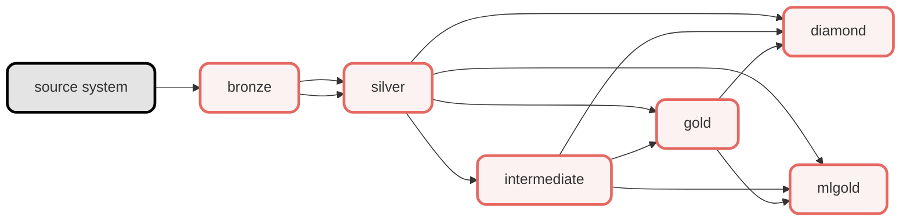

# Data Model Project
This project holds code for the ETL pipelines of the Data Platform. We use [Databricks Notebooks](https://docs.databricks.com/en/notebooks/index.html) for ingestion, [dbt](https://docs.getdbt.com/) for transformations, and [Databricks Asset Bundles (DAB)](https://docs.databricks.com/en/dev-tools/bundles/index.html) for orchestration and deployment of the code to Databricks.

## 📋 Table of Contents

1. [🏗️ Architecture Overview](#-1-architecture-overview)
2. [📁 Project Structure](#-2-project-structure)
3. [🚀 Getting Started](#-3-getting-started)
4. [📚 More documentation](#-4-more-documentation)

## 🏗️ 1. Architecture Overview

The data pipeline follows a medallion architecture pattern, organizing data into four distinct layers based on data quality and business readiness. A more comprehensive overview can be found in [Outline](https://chef.getoutline.com/doc/high-level-design-M2FEL3a57U).

| Layer/Schema | Purpose | Description | Source |
|---------|--------|-------------|---------|
| 🥉 **bronze** | Raw data ingestion | Unprocessed data from source systems | Source Systems |
| 🥈 **silver** | Data cleansing & standardization | Cleaned, typed, and standardized data | Bronze |
| 🏄 **intermediate** | Business logic & calculations | Reusable transformations and business logic | Silver |
| 🥇 **gold** | Analytics-ready dimensions & facts | Dimensional model for analytics | Silver / Intermediate |
| 💎 **diamond** | Advanced analytics | Specialized analytics and aggregations | Silver / Intermediate / Gold |
| 🤖 **mlgold** | Machine learning features | Features engineered for ML models | Silver / Intermediate / Gold |

### 1.1 Data Flow



### 1.2 More about Medallion Architecture:
📖 [Databricks about Medallion Architecture](https://www.databricks.com/glossary/medallion-architecture)   
📖 [Medallion Architecture](https://learn.microsoft.com/en-us/azure/databricks/lakehouse/medallion)

## 📁 2. Project Structure

```
data-model/
├── docs/                     # Documentation
├── envops/                   # Environment operations
├── export/                   # Data export utilities
├── ingest/                   # Data ingestion scripts
├── jobs/                     # Databricks job definitions
├── powerbi-refresh/          # PowerBI refresh automation
├── reusable/                 # Helper functions
├── transform/                # dbt project
└── useful/                   # Helper functions
```

## 🚀 3. Getting Started

### 3.1 Prerequisites

- [Set up sous-chef and related installations](https://github.com/cheffelo/sous-chef/blob/main/README.md).
- Access to Cheffelo's Databricks workspace

### 3.2 Set up dbt

#### 3.2.1 Set up a local dbt profile
To get started developing in dbt, you need to set up a local dbt profile configuration. Your local dbt profile is used to connect to Databricks. The connection details are stored in a YAML file at the following path on your computer: `[USERPATH]/.dbt/profiles.yml`. Please follow the instructions below to set up the profile:
1. Navigate to your user profile folder on your computer
2. View hidden folders: 
    * Mac: `cmd+shift+dot`
    * Windows: Right click and press "show hidden"
3. Create a folder called `.dbt`
4. Create a file called `profiles.yml` inside the `.dbt` folder
5. Open the file in your code editor
6. Add the script below and modify the file:

```yml
 transform:
  target: local_dev
  outputs:
    local_dev:
      type: databricks
      catalog: dev
      schema: ~firstname_lastname # Need to be configured by you
      host: adb-4291784437205825.5.azuredatabricks.net
      http_path: /sql/1.0/warehouses/45100b61eb7ee2f5
      token: dapiXXXXXXXXXXXXXXXXXXXXXXX # Need to be configured by you
      threads: 4

    dev:
      type: databricks
      catalog: dev
      schema: dev
      host: adb-4291784437205825.5.azuredatabricks.net
      http_path: /sql/1.0/warehouses/45100b61eb7ee2f5
      token: dapiXXXXXXXXXXXXXXXXXXXXXXX # Need to be configured by you, same as in local_dev
      threads: 4

    test:
      type: databricks
      catalog: test
      schema: test
      host: adb-4291784437205825.5.azuredatabricks.net
      http_path: /sql/1.0/warehouses/45100b61eb7ee2f5
      token: dapiXXXXXXXXXXXXXXXXXXXXXXX # Need to be configured by you, same as in local_dev
      threads: 4

    prod:
      type: databricks
      catalog: prod
      schema: prod
      host: adb-4291784437205825.5.azuredatabricks.net
      http_path: /sql/1.0/warehouses/45100b61eb7ee2f5
      token: dapiXXXXXXXXXXXXXXXXXXXXXXX # Need to be configured by you, same as in local_dev
      threads: 4
```
Replace the values in the following fields:
- `schema: ~firstname_lastname`: The schema should be your first name and last name in the following format: `firstname_lastname`.
- `token: dapiXXXXXXXXXXXXXXXXXXXXXXX`: Follow [these instructions](https://docs.databricks.com/en/dev-tools/auth/pat.html#databricks-personal-access-tokens-for-workspace-users) to generate a personal access token.

>[!WARNING]
>Never store the token anywhere other than in the `.dbt/profiles.yml` file or in a safe key vault.

#### 3.2.2 Test connection to Databricks

1. Open sous-chef in your code editor (i.e., Visual Studio Code)
2. Enter the data-model project folder: `cd projects/data-model`
3. Activate the virtual environment: `poetry shell` or `poetry source .venv/bin/activate` (if using poetry>=2.0.0) 
4. Install dependencies: `poetry install`
5. Enter the dbt project: `cd transform`
6. Run `dbt debug` in the terminal

The output from running `dbt debug` should look something like this if the setup is done correctly. If all checks pass, you are ready to start developing in dbt. 🥳

```shell
07:21:56  Running with dbt=1.8.3
07:21:56  dbt version: 1.8.3
07:21:56  python version: 3.11.7
07:21:56  python path: /Users/marie.borg/Library/Caches/pypoetry/virtualenvs/data-model-tSUiXESf-py3.11/bin/python
07:21:56  os info: macOS-14.5-arm64-arm-64bit
07:22:02  Using profiles dir at /Users/marie.borg/.dbt
07:22:02  Using profiles.yml file at /Users/marie.borg/.dbt/profiles.yml
07:22:02  Using dbt_project.yml file at /Users/marie.borg/Documents/Cheffelo/sous-chef/projects/data-model/transform/dbt_project.yml
07:22:02  adapter type: databricks
07:22:02  adapter version: 1.8.3
07:22:02  Configuration:
07:22:02    profiles.yml file [OK found and valid]
07:22:02    dbt_project.yml file [OK found and valid]
07:22:02  Required dependencies:
07:22:02   - git [OK found]

07:22:02  Connection:
07:22:02    host: adb-4291784437205825.5.azuredatabricks.net
07:22:02    http_path: /sql/1.0/warehouses/7a406a7f9665587e
07:22:02    catalog: dev
07:22:02    schema: marie_borg
07:22:02  Registered adapter: databricks=1.8.3
07:22:11    Connection test: [OK connection ok]

07:22:11  All checks passed!
```

### 3.3 Set up Databricks CLI
#### 3.3.1 Set up a local Databricks Configuration
To be able to deploy jobs locally, you need to set up a local databricks profile configuration. The connection details are stored in a YAML file at the following path on your computer: `[USERPATH]/.databrickscfg`. 
Please follow the instructions below to set up the profile:
1. Navigate to your user profile folder on your computer
2. View hidden folders: 
    * Mac: `cmd+shift+dot`
    * Windows: Right click and press "show hidden"
3. Create a file called `.databrickscfg`
4. Open the file in your code editor
5. Add the script below and modify the file:

```yml
[DEFAULT]
host      = https://adb-4291784437205825.5.azuredatabricks.net
token     = dapiXXXXXXXXXXXXXXXXXXXXXXX #Need to be configured by you

[SP-dev]
host          = https://adb-4291784437205825.5.azuredatabricks.net/
client_id     = afa25b66-d0ac-476c-a8e1-6db8ca327030
client_secret = doseXXXXXXXXXXXXXXXXXXXXXXX #Can be found in key vault
```
Replace the values in the following fields:
- `token = dapiXXXXXXXXXXXXXXXXXXXXXXX`: Follow [these instructions](https://docs.databricks.com/en/dev-tools/auth/pat.html#databricks-personal-access-tokens-for-workspace-users) to generate a personal access token. Or use the one you created when setting up dbt. 
- `client_secret = doseXXXXXXXXXXXXXXXXXXXXXXX`: Find the secret in [key vault](https://portal.azure.com/#@godtlevertno.onmicrosoft.com/resource/subscriptions/5a07602a-a1a5-43ee-9770-2cf18d1fdaf1/resourceGroups/rg-chefdp-common/providers/Microsoft.KeyVault/vaults/kv-chefdp-common/secrets), under the secret name `databricks-sp-bundle-secret-dev`

#### 3.3.2 Test with bundle validate

1. Open sous-chef in your code editor (i.e., Visual Studio Code)
2. Enter the data-model project folder: `cd projects/data-model`
3. Run `databricks bundle validate` in the terminal and verify that the bundle is successfully validated.

## 📚 4. More documentation

- [Ingestion Guide](docs/01_INGESTION.md) - Data ingestion patterns and processes
- [Transformation Guide](docs/02_TRANSFORMATION.md) - dbt models and transformation logic
- [Orchestration Guide](docs/03_ORCHESTRATION.md) - Databricks Jobs and Databricks Asset Bundles

