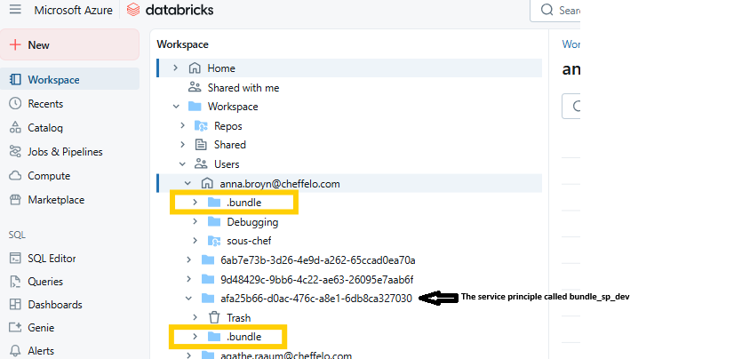
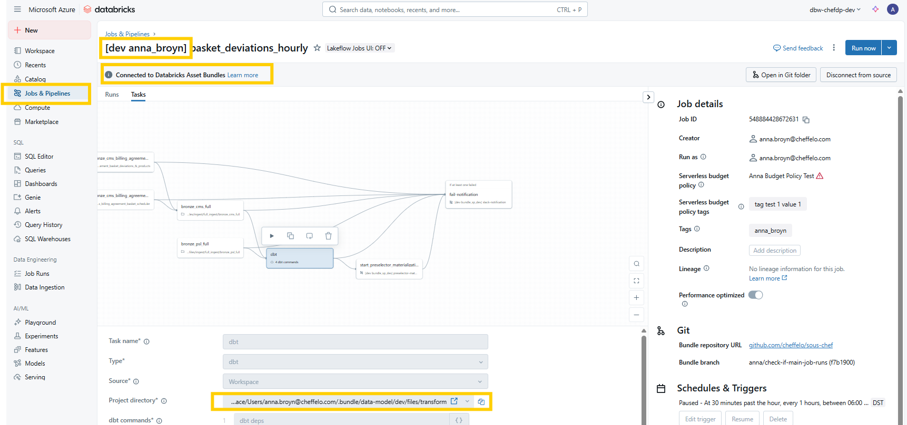

# Databricks Jobs Configuration
This document provides guidance on how to configure jobs in Databricks using Databricks Asset Bundles (DABs) for orchestration.

## Table of Contents

1. [📦 Intro to Databricks Asset Bundles](#-1-intro-to-databricks-asset-bundles)
2. [📂 Folder Organization](#-2-folder-organization)
3. [⚙️ Bundle Configuration](#️-3-bundle-configuration)
4. [🚀 Jobs](#-4-jobs)
5. [✅ Validate and Deploy](#-5-validate-and-deploy)

## 📦 1. Intro to Databricks Asset Bundles
[DABs](https://docs.databricks.com/aws/en/dev-tools/bundles/) make it possible to describe Databricks resources such as jobs and pipelines in code. Ultimately a bundle is an end-to-end definition of a project, including how the project should be structured, tested, and deployed.

## 📂 2. Folder Organization
Below is the file tree of the Data Model bundle.
```
data-model
├──jobs/   
│   ├── job-a.yml      # Configuration for job a
│   ├── job-b.yml      # Configuration for job b
└──databricks.yml      # Project wide configs
```
All files in the `data-model` folder will be deployed as a part of the bundle to a `.bundle` folder in the Databricks Workspace and may be referenced from the jobs, see section [What happens on Deploy](#52-what-happens-on-deploy) for more details.

## ⚙️ 3. Bundle Configuration
The project has a `databricks.yml` file which defines the bundle. It should contain the following blocks: 

|Block Name| Description |
|----------|-------------|
|bundle    |Defines what other yaml files that are included in the bundle definition. This should include the jobs folder (see description below) like this: <br> `include:`<br>`-jobs/*.yml`|
|variables | Defines variables needed in the bundle |
|targets   | Defines the target environments that can have different configurations, e.g. different modes, variables and job configurations.|

## 🚀 4. Jobs
In Databricks, a job is used to schedule and orchestrate tasks on Databricks in a workflow. Common data processing workflows include ingestion tasks, running notebooks, machine learning (ML) workflows and dbt tasks.

### 4.1 Jobs Folder Content
In `data-model/jobs`, we define the jobs that should be published to Databricks. Each job should be its own file in this folder and the name of the file should be the same as the job name. 

The jobs folder should only contain yaml files with job configurations. Notebooks and scripts defining transformations etc. should be in separate folders and referred to from the job yaml files. 

### 4.2 Job Configuration
See [Databricks Jobs Documentation](https://docs.databricks.com/aws/en/jobs/) to understand how jobs work.
Each job is defined in a `.yml` file and consist of the following parts:
- `name`: The name of the job that will show in Databricks
- `tags`: Tagging of the job - see more details below
- `permissions`: Permissions allowing groups to manage and run the job.
- `timeout_seconds`: Indicates how long the job can run for before it is timed out.
- `edit_mode`: States if the job should be possible to edit in the workspace. 
- `schedule`: An optional periodic schedule for the job.
- `tasks`: Lists the tasks that is a part of the job. See more details below. 
- `job_clusters`: A list of job cluster specifications that can be shared and reused by tasks of this job. See more details below.
- `environments`: A list of task execution environment specifications that can be referenced by serverless tasks of this job. See more details below.
- `parameters`: Job-level parameter definitions
For a full list of possible configurations see the [Rest API documentation](https://docs.databricks.com/api/workspace/jobs/create) as well as the general [job configuration documentation](https://docs.databricks.com/aws/en/jobs/configure-job).

#### 4.2.1 Tasks
Each task is of a specific type. The most commonly used in our project are: 
- `run_job_task`: Runs another job
- `notebook_task`: Runs a notebook found on the relative path to the job
- `dbt_task`: Runs dbt commands on the dbt project
See more [job task examples here](https://docs.databricks.com/aws/en/dev-tools/bundles/job-task-types). 

The DAG is defined using the `depends_on` property on each task. 

#### 4.2.2 Compute and Job Clusters
Unless specified otherwise the tasks will use the serverless compute to run. 
You can also configure job clusters which can be used by the tasks. 
We have not yet decided on a final strategy on when to use serverless compute and when to use job cluser compute. 
dbt tasks will need to use SQL Warehouses when doing the transformations and this is specified by the `warehouse_id` in the dbt task. 
See more information about compute in [Outline](https://chef.getoutline.com/doc/compute-hJMBQnxLb3).

#### 4.2.3 Environments
`environments` can be used to specify specific libraries needed when using the serverless compute. E.g. when using serverless compute for the dbt cli in the dbt tasks we need to add `dbt-databricks` as a dependency. 

#### 4.2.4 Tags
**The purpose of tags**

The purpose of tags is to assign cost to work that we do, where we can say that "our work on forecasting costs us X, and the preselector costs us Y", and "our most dbt transformation job is Z"
We therefore have to be a bit loose with these tags because our work is quite interconnected. For example, we have jobs in data-model project which run dbt transformations for the preselector or for forecasting and should be tagged as such.

**What do the tags mean**

`tool`: The tool/product/project that the job or compute is being used for. Not necessarily the project where the job file is stored.
For example, a job in the data-model project which is running some dbt commands that results in data for forecasting would be tagged as tool: "Forecasting"

`purpose`: The action that is taking place in the job or compute.
For example, if the job is transforming data using dbt for the purposes of the preselector , then it would be tagged as tool: "Preselector", purpose: "transformation"

## ✅ 5. Validate and Deploy 

### 5.1 Commands to deploy
You can validate that the jobs and bundle configuration is done correctly by running the command 
```
databricks bundle validate --profile <profile name> --target <target name>
```
and then deploy the bundle to databricks using the command
```
databricks bundle deploy --profile <profile name> --target <target name>
```
The profile is defined in the `.databrickscfg` file (see [Set up Databricks CLI](../README.md/#33-set-up-databricks-cli)). 
If no profile or target is provided it will use the default profile, `DEFAULT`. 

The target is defined in the `databricks.yml` file (see section [databricks.yml](#️-3-bundle-configuration)). If no target is provided it will use the default target.
We will usually only use dev as target when deploying locally, as deployment to test and prod will be done through GitHub Actions (see the section [CI/CD](#53-cicd) below.)

### 5.2 What happens on deploy
When running `databricks bundle deploy` the following will happen: 

The `data-model` folder will be deployed to Databricks with all its file contents. The content will be found in Databricks in `Workspace --> Users --> <The user of the profile used on deploy> --> .bundle`. 



And the jobs will be deployed and can be found under `Jobs & Pipelines`. The jobs will be refering to files in the deployed `.bundle` folder.


The target mode (defined in the `databricks.yml` file) will define _how_ the job will be deployed: 
- If the target mode is `development`, the job will get prefixed with `[dev <username>]`, and the schedule will be paused (unless overwritten).
- If the target mode is `production`, the job will not get any prefix and the schedule will be unpaused (unless overwritten e.g. by presets). 

### 5.3 CI/CD
The bundle will be deployed to each environment as a part of the GitHub Actions. See `sous-chef/.github/workflows/cd_data_model`.