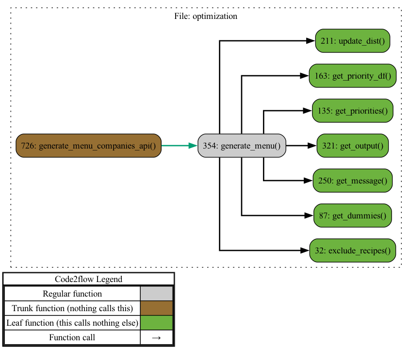
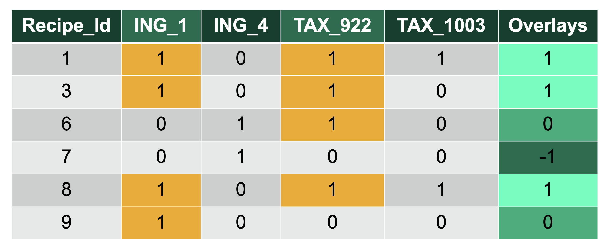

# 🍱 Menu Optimiser 🥗

The menu optimiser, also abbreviated as M(enu) OP(timiser), MOP, is a tool to speed up the creation of menus for all 4 brands.
The menu team and PIM are the primary users of MOP.  The analytics team deploys MOP through the Analytics API where it is made available as an endpoint.

The overall flow of control is depicted as follows:
<p align="center">

</p>

## Input
MOP takes a JSON input, received from the request payload from PIM. It has the following format:

````
{
  "year": 0,
  "week": 0,
  "companies": [
    {
      "companyId": "string",
      "numRecipes": 0,
      "requiredRecipes": [
        "string"
      ],
      "availableRecipes": [
        "string"
      ],
      "taxonomies": [
        {
          "taxonomyId": 0,
          "quantity": 0,
          "taxonomyTypeId": 0,
          "wanted": 0,
          "actual": 0,
          "mainIngredients": [
            {
              "mainIngredientId": 0,
              "quantity": 0,
              "wanted": 0,
              "actual": 0
            }
          ],
          "priceCategories": [
            {
              "priceCategoryId": 0,
              "quantity": 0,
              "wanted": 0,
              "actual": 0
            }
          ],
          "cookingTimes": [
            {
              "from": 0,
              "to": 0,
              "quantity": 0,
              "wanted": 0,
              "actual": 0
            }
          ],
          "minAverageRating": 0
        }
      ],
      "recipes": [
        {
          "recipeId": 0,
          "mainIngredientId": 0,
          "isConstraint": true
        }
      ]
    }
  ]
}
````

The fields `requiredRecipes` and `availableRecipes` are controlled by PIM periodically to account for specific recipes (e.g. entirely new dishes) that need to be added or dishes no longer available (e.g. ingredient unavailability).

The following fields are the business constraints for creating a menu week :
- `taxonomies`
- `mainIngredients`
- `minAverageRating`
- `priceCategories`
- `cookingTimes`


## Output

The output is also a JSON payload in `camelCase` and looks like the following:

````
{
  "week": 0,
  "year": 0,
  "status": 0,
  "statusMsg": "string",
  "companies": [
    {
      "companyId": "string",
      "numRecipes": 0,
      "requiredRecipes": [
        "string"
      ],
      "availableRecipes": [
        "string"
      ],
      "taxonomies": [
        {
          "taxonomyId": 0,
          "quantity": 0,
          "taxonomyTypeId": 0,
          "wanted": 0,
          "actual": 0,
          "mainIngredients": [
            {
              "mainIngredientId": 0,
              "quantity": 0,
              "wanted": 0,
              "actual": 0
            }
          ],
          "priceCategories": [
            {
              "priceCategoryId": 0,
              "quantity": 0,
              "wanted": 0,
              "actual": 0
            }
          ],
          "cookingTimes": [
            {
              "from": 0,
              "to": 0,
              "quantity": 0,
              "wanted": 0,
              "actual": 0
            }
          ],
          "minAverageRating": 0
        }
      ],
      "recipes": [
        {
          "recipeId": 0,
          "mainIngredientId": 0,
          "isConstraint": true
        }
      ]
    }
  ]
}
````

## Algorithm

-  The MOP algorithm checks for overlaps with a given combination of business constraints (overlays).
- Dishes with highest number of overlays are chosen first.
  - if multiple dishes have same number of overlays, then they are chosen at random
- If number of required recipes is not satisfied:
   - dishes with fewer overlays are chosen, with `mainIngredient`being prioritised
- If the number of dishes is still not satisfied:
  - dishes that do not have any overlays and with `recipe_universe=False` can be chosen

The following depicts a dummy example demonstrating the concept:
<p align ="center">

</p>

- When a dish has both the required `ingredient` and `taxonomy` it gets the an __overlay = 1__. Do note that number of overlays can be greater than 1 and recipes are prioritised on the number of overlays.
- If either `ingredient` or `taxonomy` is absent, then the __overlay = 0__.
- Finally, if both `ingredient` or `taxonomy` are absent, thent the __overlay = -1__.

## Code details

Some details of the key functions in the code are:

- `exclude_recipes`: Excludes recipes based on a minimum rating.
- `assign_interval`: Assigns a value to an interval or returns "Other" if not within any interval.
- `get_dummies`: Creates a DataFrame with binary columns for constraints.
- `get_priorities`: Orders recipes by universe and ingredients.
- `generate_menu`: Generates a menu combination from all recipes.
- `generate_menu_companies_sous_chef`: Generates menus for companies based on available and required recipes.
- `generate_menu_companies_api`: Asynchronously generates menus for companies using API calls.
- `update_dist`: Updates the distribution of protein quantities based on the given DataFrame and returns the updated distribution and the modified wanted DataFrame. It subtracts quantities from the distribution and removes corresponding rows from the wanted DataFrame.
- `get_priority_df`: Generates a priority DataFrame based on overlay calculations and specified recipes. It selects the subset of the DataFrame with the maximum number of overlays or uses the entire DataFrame if specified.
- `get_output`: Constructs a dictionary containing various output details such as status, message, ingredients, price categories, cooking times, and recipes.
- `get_message`: Generates a status message based on the completeness and availability of ingredients, prices, and cooking times for recipes. It returns a status code and a message string indicating success or warning.

## Usage

1. **Setup**: Ensure all dependencies are installed from `pyproject.toml` and the environment is configured.
2. **Run Optimization**: Use the provided functions to filter and generate menus based on your requirements. When running locally, e.g. through the provided Jupyter Notebook under `/notebooks`, use `generate_menu_companies_sous_chef` to test and tweak.
3. **API Integration**: Utilize the API functions to integrate menu generation into your applications.

### Logging

- Since MOP is primarily intended to be used via the API, the logs are available in Datadog. When testing locally in the API, datadog automatically assigns the tag `env:dev`.
