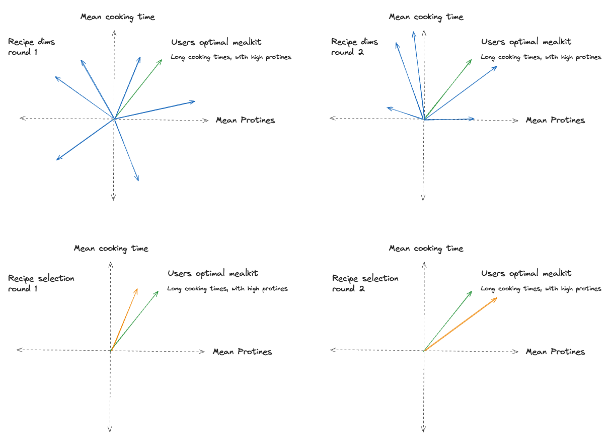
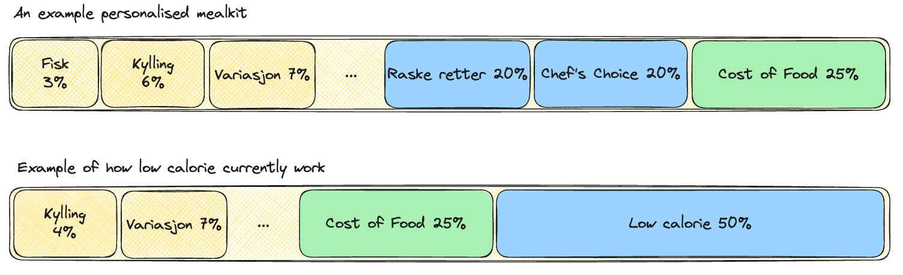

# Preselector

The preselector project selects out the **optimal combination** of recipes through out a week.


## The Problem to solve

Even though we recommend the default selection that a customer will get for a week, is this not a classical recommendation problem.
This is due the the nature where the recommendation of the recipe $n$ is dependent on the recipes $0 \rightarrow n - 1$.

Therefore, at the time of this writing is this more of an optimalisation problem then a ml problem, even tho a few of the optimalisation dimensions are outputs of other ml models.

### The high-level concept

This have lead to an approach where we do a bredth first search through a multi dimensional space.

Below is an image that tries to indicate how the pre-selector computes the different dimensions for all recipes and selects the closes one. And then goes through an iteritive process by adding one by one.


Here are the blue arrows candicates, the green is the target vector and the orange is the closes recipe for a given iteration.

#### Target vector
In the vector defines the characteristic of a mealkit that the customer would ideally get. This could mean 100% family friendly, or a mean cooking time of 15 min.
At the time of this writing do we compute the target vector by taking the mean of multiple historical orders.

This is also indicated by the green line in the preselector search image.

#### Importance Vector
Having an ideal vector to hit is good. However, it is not enough as different customers have different prefeferences.
Meaning they may have the same target vector, but would still want a different behavior.
E.g. I might have ordered a mealkit with a mean cooking time of 15min, but the cooking time is not that important to get right.

This is why we also have an importance vector which indicates which dimensions that it is important to get right.
You can think of it as describing how important each dimension is with a percentage.
E.g. it is 20% important to get cost of food correct, 10% to get number of chicken dishes correct, and 5% to get variation correct.



Such a vector is used when computing what the error will be for all recipes.
This also means that we can inject business logic into the algorithm, such as hitting the cost of food, which is important to make sure we do not spend too much.


## Get started

### Most important files
The pre-selector contains many moving parts. However, the most important file is `preselector/main.py`.
This contains all of the logic that computes the best recipes, how we load the data, and how we validate data.

The second most important file is the `preselector/process_stream.py` which is the worker node that process every request in production.
This will read from an Azure Servicebus, making it easy to complete tasks async and meaks it easy to scale up processing power if needed.

### Run the pre-selector
Before you manage to get started you will need to set the following environment variables in a `.env` file.

```
DATALAKE_SERVICE_ACCOUNT_NAME="gganalyticsdatalake"
DATALAKE_STORAGE_ACCOUNT_KEY="..."
ADB_CONNECTION="DRIVER=ODBC Driver 18 for SQL Server;DATABASE=AnalyticsDB;UID=...;SERVER=gg-analytics-fog.database.windows.net;PORT=1433;PWD=..."
```

There are multiple apps but to get started and understand the pre-selector do we recommend to startup the `combination-app` in the `docker-compose.yaml` file.


Run one of the following to start the app:

Through `chef`
```bash
chef up combination-app
```

Through `docker-compose`
```bash
docker compose up combination-app
```

This should start an app at `http://localhost:8506` which makes it possible to experiment with different combinations and explain why the pre-selector outputs what it does.


## Suggested Development

It is recommended to develop everything locally through `docker`. This is due to the combination of Databricks and Azure resources, as they serve different purposes.

If you do any local changes, startup the `combination-app` and run the app to see if fix the issue.

## Get familiar with the project
If you are new to the project, it is recommended to open the `combination-app` and go nuts.
Try to break it, print as much as possible to `streamlit` and so on.
This should hopefully make it easier to understand what each component do, in a safe environment.

## Debugging
If any customers have any issues in production, then startup the `debug` app, again through `docker compose`.
This will find the generation request that the customer had, and try to reproduce the results as closely as possible.
There is a possibility of data drift, so a 1:1 recreation is probably not possible.

### Logging
All of the logs can be found in `DataDog`. Here can we filter on the company worker, the environment, and get some insights into the performance and when something errored.

## Cost of Food
There is a app to measure Cost of Food as well. This can be started with `docker compose cof-app`.

## Inspect data
If you want to inspect some of the data used in the pre-selector, then start up the catalog with `chef catalog`. This will start an app that enables you to run SQL queries and explore the data in the `data-contracts` package.

You may need to setup a `.env` in the root of `sous-chef`.
