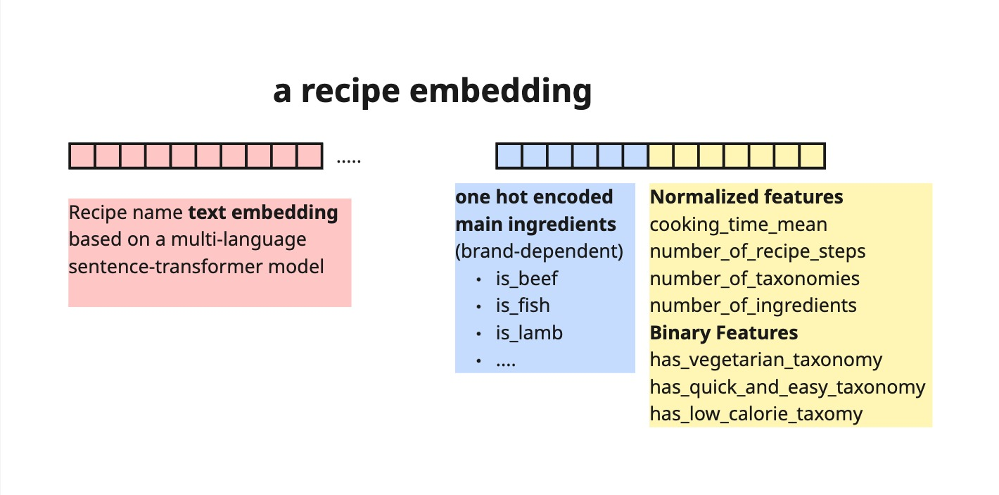
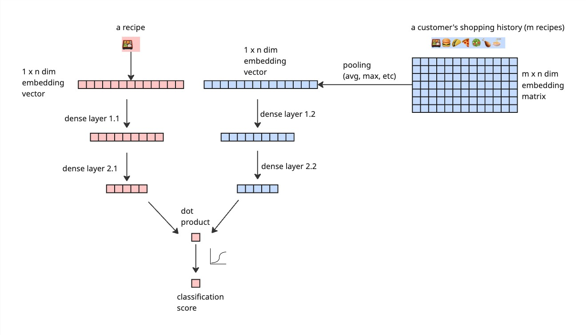

# 🤤 Reci-Pick

An two-tower embedding-based recommender systems for learning customer taste preference and making personalized dishes recommendations.

## 🧱 The building block: recipe embedding
Recipe embeddings are the main element in this project. Both users and recipes are represented by a vectors generated based on recipe information.

A recipe embedding in this project is shown in the diagram above: given a main recipe (identified by a `main_recipe_id`), it is converted into an n-dimensional vector. In more details, each embedding contains 3 components:

- recipe name text embedding: we use a pre-trained [sentence-transformer](https://huggingface.co/sentence-transformers/LaBSE) to transform texts (recipe names) into a 768-dimensional vector

- one-hot encoded vectors: this is based on each recipe's main ingredient. Typical values are: Beef, Poultry, Pork, Fish, etc. These categorical values are one-hot encoded, and is brand dependent.

- Other numerical features: information such as cooking time, number of steps, number of ingreidents etc are normalized; and we also include binary features such as `has_vegetarian_taxonomoy`.

All three components are concated into a 1-dimensional vector for each recipe. But all recipes under the same brand have the same dimensions

## 🗼🗼 The two-tower architecture

This architecture is inspired by a classic two-tower embedding based recommender system, in which both the customers and the items, in our case, recipes, are represented by an embedding vectors of the same dimensions. Read more [here](https://towardsdatascience.com/introduction-to-embedding-based-recommender-systems-956faceb1919/).

### User embedding & recipe embedding
A recipe's embedding comprises of the different components described in the section above. On the other hand, a user's embedding is an aggregation of the recipes they have ordered in the past. In this project, we use a simple average of the recipe embeddings of the past orders to represent a user's taste preference.

Such embeddings can also be learned using embedding layers, however, we found that learned embeddings are more prone to overfitting; and the text embeddings are much more powerful than learned embeddings. The dense layers on both towers are simply processing layers that reduces the embeddings dimensions. In my experiments, I found that it does not make much difference to add more than two processing layers, or add drop outs.

### Output layer
Instead of predicting a "rating" score like a classical recommender system, we use a classification model as output to measure how likely a user would order a recipe.

## 🔢 Training data preparation

### 🥘 Recipe inputs
This is the most straight forward part. We use all main recipes and apply the recipe embedding process described above.

### 👯‍♂️ User inputs
We differentiate a user based on how many recipes they have ordered in the past. We use the customers' purchase history since 2024-01-01 at the moment (may be updated in the future). A cold start user is defined as a user who has ordered less than 5 recipes in the past, and a regular user is defined as a user who has ordered more than 5 recipes in the past.

For non-cold start users, we use the average recipe embedding of all recipes they have ordered in the past as their user-profile.

For cold start users, we construct their user profiles with the help with the concept preference. For the concept the user is currently on, we calculate the top 5 most popular recipes; for a customer with `x` recipes purchased (0 <= x < 5), we pad 5-x recipes to pretend they have purchased 5 recipes, and their user profiles are calculated based on a combination of purchased (if any) and padded popular concept recipes.

### 🎯 Target
The target is binary. For each user-recipe pair, if a user has purchased a recipe the target is 1.

The negative label is slightly more complex. We first exclude any recipe that a user has purchased for consideration. Then at each menu week, for all the recipes that are on the menu and not purchased by the user, we randomly sample the same amount of negative recipes as the number of recipes that the user has purchased. In this way we have a balanced dataset.

## 🏋 Training
For train-validation split, we set aside the latest n (= 6 at the moment) weeks of data as the validation set. This means both the user profile at the training set is also only based on the data before the split point.

I have not seen the benefit of retraining the model with the entire dataset after validation. We set early stopping based on the validation accuracy. Typically the model converges after 50 epochs.

## 🏭 Post processing
The prediction score of a user-recipe pair is only the first step for making recommendations. We use the following steps to make top k recommendations.

After the user-recipe score is predicted, we also follow these steps to modify the scores:

- For a recipe that was previously purchased `x` times by a user, we add a bonus score of `new_score = old_score + 0.25 * x`
    - For a recipe that is newly added (and therefore has not been purhcased by any user yet), if it has a cosine similarity score higher than 0.9 with any existing recipe, we will reward the bonus point according to the old recipe that was similar.
- For a recipe that has violated a customer's allergens, the score will be set to 0

- For a recipe that has violated a customer's main protein negative preference, the score will be modified as `new_score = old_score * 0.1`
After these modifications, we sort the recipes based on the scores and make top k recommendations.

- For a recipe that has appeared on the menu too often, we will penalize these recipes probabilistically so that the recommendations don't look too repetitive week-on-week.
This is done by the following steps:
    - For each recipe on a week's menu, calculate the number of weeks `n` since a recipe was last on the menu. For a recipe that is on the menu every week, `n` is typically 1, while a new recipe would have `n = infinity`
    - Calculate the probability that a score should be penalized as `P(penalize) = exp(alpha * n). At the moment, alpha = -1, which will make a recipe that is on the menu every week has a 36.7% chance to be penalized.
    - Create a random number between 0 and 1 for each recipe. If the number is less than `P(penalize)`, the score will be penalized as 0.1 * original score.

## 👍 Top k recommendations
For each user and each week, we rank all the recipes according to the modified scores, and make top k recommendations. k = 10 at the moment.

## 📈 Evaluation
We evaluate choose the most classic precision@k, k= 10 as our main metric for evaluation. This metric is calculated as the proportion of the top k recommended recipes that are actually purchased by the user in the predicted menu week.
